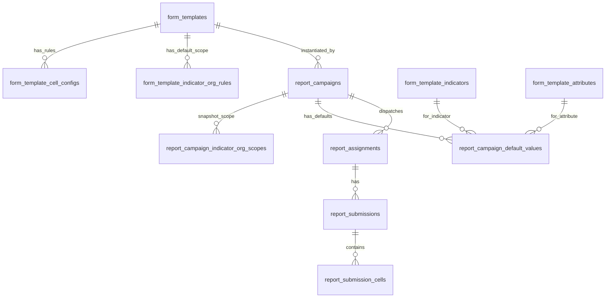

# KPI REPORT SYSTEM — PROJECT ANALYSIS

> Tài liệu phân tích tổng hợp hệ thống, bao gồm kiến trúc hiện tại và các thay đổi nghiệp vụ đã thống nhất.
> Cập nhật: 2026-05-09

---

## 1. Tổng Quan Dự Án

**BE-KPI System** là hệ thống backend quản lý và tổng hợp dữ liệu KPI cấp xã của VNPT,
phục vụ mô hình chính quyền địa phương hai cấp (huyện → xã/phường).

Hệ thống cho phép:
- Thiết kế biểu mẫu báo cáo chuẩn hóa (Template).
- Tạo đợt báo cáo theo kỳ (Campaign) từ template.
- Giao việc cho đơn vị (Assignment) sau khi xác nhận cấu hình.
- Đơn vị nhập liệu, nộp báo cáo (Submission).
- Phê duyệt và tổng hợp phân tích (Summary/Analytics).

### Tech Stack

| Thành phần      | Công nghệ              |
| --------------- | ----------------------- |
| Runtime         | Node.js                 |
| Framework       | NestJS (TypeScript)     |
| Database        | PostgreSQL              |
| ORM             | TypeORM                 |
| Auth            | JWT (Access + Refresh)  |
| API Docs        | Swagger/OpenAPI (`/api`)|
| Port mặc định   | `5000`                  |
| API prefix      | `/api/v1`               |

---

## 2. Mô Hình 3 Tầng Nghiệp Vụ

```
Template (khung)          Campaign (thực thể theo kỳ)        Assignment (giao việc)
───────────────           ──────────────────────────         ─────────────────────
"Biểu mẫu thống kê       "Tháng 1/2026"                    "Tháng 1 → Xã A"
 dân cư"                  "Tháng 2/2026"                    "Tháng 1 → Xã B"
                          "Tháng 3/2026"                    "Tháng 1 → Xã C"

Cấu hình:                Dữ liệu report:                   Dữ liệu nhập liệu:
- indicators              - defaultValues (chung campaign)   - submission_cells (riêng org)
- attributes              - scope snapshot (org↔indicator)
- cell_config (rules)
- scope mặc định
```

### Nguyên tắc cốt lõi

| Tầng       | Vai trò                                               | Có dữ liệu? |
| ---------- | ----------------------------------------------------- | ------------ |
| Template   | **Khung cấu trúc** — định nghĩa biểu mẫu, quy tắc   | Không        |
| Campaign   | **Thực thể theo kỳ** — clone từ template, có dữ liệu  | Có (defaultValues) |
| Assignment | **Giao việc** — batch của campaign cho từng đơn vị      | Có (submission_cells) |

---

## 3. Kiến Trúc Module (NestJS)

11 module trong `src/modules/`, tổ chức theo Bounded Context:

```
src/modules/
├── auth/                   # Identity & Access (JWT, refresh token, password reset)
├── user/                   # Quản lý người dùng
├── role/                   # RBAC: roles ↔ permissions
├── organization/           # Cây tổ chức đơn vị (parent_id + closure table)
├── template-management/    # Thiết kế biểu mẫu KPI
├── report-campaign/        # Đợt báo cáo + giao việc
│   └── assignment/         # Sub-module phân công đơn vị
├── submission/             # Nhập liệu & nộp báo cáo
├── approval/               # Phê duyệt báo cáo
├── summary-analytics/      # Tổng hợp & phân tích KPI
├── audit-log/              # Nhật ký kiểm toán
└── notification/           # Thông báo
```

---

## 4. State Machines

### 4.1 Template

```
DRAFT → READY → IN_USE → ARCHIVED
```

| Status     | Cho phép                          |
| ---------- | --------------------------------- |
| `DRAFT`    | Sửa cấu trúc (indicators, attributes, cell_config, scope) |
| `READY`    | Sửa cấu trúc, cho tạo campaign   |
| `IN_USE`   | **Khóa cấu trúc**, chỉ clone     |
| `ARCHIVED` | Không tạo campaign mới            |

### 4.2 Campaign

```
DRAFT → DISPATCHED → CLOSED
      ↘ CANCELLED
```

| Status       | Cho phép                              |
| ------------ | ------------------------------------- |
| `DRAFT`      | Sửa scope, sửa defaultValues, sửa deadline |
| `DISPATCHED` | Khóa scope + defaultValues, đã sinh assignment |
| `CLOSED`     | Kết thúc đợt báo cáo                 |
| `CANCELLED`  | Hủy campaign                          |

### 4.3 Submission

```
DRAFT → PENDING → APPROVED
               ↘ REJECTED → PENDING (resubmit)
```

---

## 5. Phân Tách 3 Loại "Giá Trị"

Đây là điểm kiến trúc quan trọng nhất, cần phân biệt rõ ràng:

### 5.1 cell_config (Template) — QUY TẮC

Nằm ở bảng `form_template_cell_configs`. Định nghĩa **ô hoạt động thế nào**:

| Field            | Ý nghĩa                            |
| ---------------- | ----------------------------------- |
| `dataType`       | Ô nhập số hay chữ                  |
| `isEditable`     | Ô readonly vì cấu trúc (formula…)  |
| `formula`        | Công thức tính tự động              |
| `isRequired`     | Bắt buộc nhập                       |
| `validationRule` | Ràng buộc giá trị (min/max…)        |

- **Không đổi** giữa các campaign (tháng 1, tháng 2 dùng chung rules).
- **Không có chiều `org_id`** — áp dụng chung cho mọi đơn vị.
- `defaultValue` ở template **luôn = NULL** (template = khung, không có dữ liệu).

### 5.2 defaultValue (Campaign) — DỮ LIỆU ĐIỀN SẴN

Nằm ở bảng `report_campaign_default_values` (**MỚI**). Là giá trị do người tạo đợt báo cáo điền vào report:

- **Không có chiều `org_id`** — áp dụng chung cho toàn bộ campaign.
- Tất cả assignments (xã A, B, C) đều nhìn thấy cùng bộ defaultValue.
- Ô có defaultValue → **disabled cho mọi đơn vị**, chỉ xem.
- Khi set defaultValue chỉ cần validate theo `dataType` của cell_config.

Ví dụ:
```
Campaign "Tháng 1/2026":
  - Chỉ tiêu "Kế hoạch thu thuế" × cột "Kế hoạch năm" = 500 triệu
  
  → Xã A nhìn thấy: 500 triệu (disabled)
  → Xã B nhìn thấy: 500 triệu (disabled)
  → Xã C nhìn thấy: 500 triệu (disabled)
```

### 5.3 submission_cell (Submission) — DỮ LIỆU NHẬP LIỆU

Nằm ở bảng `report_submission_cells`. Dữ liệu thực tế do từng đơn vị nhập:

- **Có chiều `org_id`** (thông qua assignment).
- Mỗi đơn vị nhập dữ liệu riêng.
- Validate theo cell_config (dataType, isRequired, validationRule).
- Reject nếu ô đã có defaultValue trong campaign.

### Bảng so sánh

| Thuộc tính     | cell_config (Template) | defaultValue (Campaign) | submission_cell (Submission) |
| -------------- | ---------------------- | ----------------------- | ---------------------------- |
| **Bản chất**   | Quy tắc                | Dữ liệu điền sẵn        | Dữ liệu nhập liệu           |
| **Ai set**     | Người thiết kế         | Người tạo đợt báo cáo    | Đơn vị                       |
| **Có org_id?** | Không                  | **Không**                | Có (qua assignment)          |
| **Bảng DB**    | `form_template_cell_configs` | `report_campaign_default_values` | `report_submission_cells` |

---

## 6. Ràng Buộc Scope (templateType)

### 6.1 Quy tắc

| templateType  | Ý nghĩa                                                  |
| ------------- | --------------------------------------------------------- |
| `AGGREGATE`   | Cùng 1 chỉ tiêu **được phép** giao cho nhiều đơn vị      |
| `UNIQUE`      | Cùng 1 chỉ tiêu **chỉ được giao cho 1 đơn vị** duy nhất |

### 6.2 Nơi enforce ràng buộc

| Tầng               | Bảng                                     | Ràng buộc UNIQUE              | Hiện trạng |
| ------------------- | ---------------------------------------- | ----------------------------- | ---------- |
| Template scope      | `form_template_indicator_org_rules`      | 1 indicator → max 1 org       | ❌ **CHƯA CÓ** |
| Campaign scope (App)| `report_campaign_indicator_org_scopes`   | Check trong `upsertScopes()`  | ✅ Có      |
| Campaign scope (DB) | `report_campaign_indicator_org_scopes`   | Trigger `trg_enforce_unique…` | ✅ Có      |

### 6.3 Cần bổ sung

Ràng buộc `templateType` phải được enforce **ngay tại template scope** (bảng `form_template_indicator_org_rules`).
Khi `templateType = UNIQUE`, hàm `upsertTemplateScopes()` phải kiểm tra:
cùng 1 `(template_id, indicator_id)` không được gán cho 2 `org_id` khác nhau.

Lý do: nếu không chặn ở template, dữ liệu sai sẽ chỉ bị phát hiện khi snapshot sang campaign → lỗi khó hiểu cho người dùng.

---

## 7. Database Schema

### 7.1 Các nhóm bảng hiện có

| Nhóm                     | Bảng chính                                                                 |
| ------------------------ | -------------------------------------------------------------------------- |
| **Identity & Access**    | `users`, `roles`, `permissions`, `user_roles`, `role_permissions`, `auth_refresh_tokens`, `auth_password_resets` |
| **Organization**         | `organizations`, `organization_closure`                                     |
| **Template Metadata**    | `form_templates`, `form_template_attributes`, `form_template_indicators`, `form_template_cell_configs`, `form_template_indicator_org_rules`, `field_categories`, `indicator_catalog` |
| **Campaign & Allocation**| `report_campaigns`, `report_campaign_indicator_org_scopes`, `report_assignments` |
| **Submission**           | `report_submissions`, `report_submission_cells`                             |
| **Analytics**            | `report_summaries` (+ materialized views)                                   |
| **Governance**           | `audit_logs`, `idempotency_keys`, `app_outbox_events`                       |

### 7.2 Bảng mới cần tạo

```sql
CREATE TABLE "report_campaign_default_values" (
    "id"            uuid PRIMARY KEY DEFAULT gen_random_uuid(),
    "campaign_id"   uuid NOT NULL REFERENCES "report_campaigns"("id") ON DELETE CASCADE,
    "indicator_id"  uuid NOT NULL REFERENCES "form_template_indicators"("id") ON DELETE RESTRICT,
    "attribute_id"  uuid NOT NULL REFERENCES "form_template_attributes"("id") ON DELETE RESTRICT,
    "value_text"    text NULL,
    "value_number"  numeric NULL,
    "created_at"    timestamptz NOT NULL DEFAULT now(),
    "updated_at"    timestamptz NULL,
    CONSTRAINT "UQ_campaign_default_values" UNIQUE ("campaign_id", "indicator_id", "attribute_id")
);

CREATE INDEX "IDX_campaign_default_values_campaign"
ON "report_campaign_default_values" ("campaign_id");
```

Đặc điểm:
- **Không có `org_id`** — defaultValue chung cho toàn bộ campaign.
- FK tới `report_campaigns` với `ON DELETE CASCADE`.
- Unique constraint trên `(campaign_id, indicator_id, attribute_id)`.

### 7.3 ERD bổ sung



---

## 8. Luồng Hoạt Động Hoàn Chỉnh

```
① Tạo Template (DRAFT)
│  └─ Cấu hình indicators (chỉ tiêu)
│  └─ Cấu hình attributes (cột)
│  └─ Cấu hình cell_config: số/chữ/formula (quy tắc)
│  └─ Cấu hình scope mặc định: org ↔ indicator
│     └─ Enforce templateType (AGGREGATE/UNIQUE)
│  └─ KHÔNG set defaultValue (template = khung)
│
② Mark Template READY
│
③ Tạo Campaign DRAFT từ Template ("Tháng 1/2026")
│  └─ Snapshot scope: form_template_indicator_org_rules → report_campaign_indicator_org_scopes
│  └─ Campaign lúc này = biểu mẫu trống (chưa có defaultValues)
│
④ Chỉnh sửa Campaign (khi DRAFT)
│  └─ Override scope nếu cần (thêm/bỏ org-indicator)
│     └─ Vẫn tuân theo ràng buộc templateType (AGGREGATE/UNIQUE)
│  └─ Set defaultValues cho các ô cần điền sẵn
│     └─ Validate: giá trị phải đúng dataType của cell_config
│     └─ Lưu vào report_campaign_default_values
│
⑤ Confirm Dispatch
│  └─ Validate campaign + scope
│  └─ Sinh report_assignments cho từng org (trong DB transaction + pessimistic lock)
│  └─ Campaign status → DISPATCHED
│  └─ Khóa scope + defaultValues
│
⑥ Đơn vị nhập liệu (Xã A mở báo cáo Tháng 1)
│  └─ API trả về:
│     ├─ cell_configs (từ template) → biết ô nào số/chữ/formula
│     ├─ defaultValues (từ campaign) → biết ô nào đã điền sẵn
│     └─ submission_cells (nếu có) → dữ liệu đã nhập trước đó
│  └─ Frontend render:
│     ├─ Ô có defaultValue → hiển thị giá trị, DISABLED
│     ├─ Ô có formula → tính tự động, DISABLED
│     ├─ Ô bình thường thuộc scope → cho nhập
│     └─ Ô không thuộc scope → ẩn hoặc disabled
│
⑦ Lưu nháp (patchCells)
│  └─ Reject nếu ô có defaultValue trong campaign
│  └─ Validate theo cell_config (dataType, isRequired…)
│  └─ Lưu vào report_submission_cells
│
⑧ Submit → PENDING
│  └─ Thông báo cho approver cùng org
│
⑨ Approve / Reject
│  └─ APPROVED → dữ liệu hợp lệ
│  └─ REJECTED → đơn vị sửa lại, resubmit
│
⑩ Tổng hợp (Summary/Analytics)
│  └─ Dữ liệu = defaultValues (campaign) + submission_cells (đơn vị nhập)
│  └─ Lưu vào report_summaries (summary_data jsonb)
│  └─ Materialized views cho dashboard KPI
```

---

## 9. Vai Trò Người Dùng

| Role             | Quyền chính                                                    |
| ---------------- | -------------------------------------------------------------- |
| **System Admin** | Toàn quyền: template, campaign, dispatch, approve, analytics   |
| **Data Manager** | Quản lý template, tạo/override campaign, set defaultValues, xem analytics |
| **Data Entry**   | Nhập liệu và nộp báo cáo (submission)                         |
| **Approver**     | Phê duyệt/từ chối submission                                  |

---

## 10. Cross-Cutting Concerns

### API
- Global prefix: `/api/v1`
- Response envelope chuẩn hóa: `ApiEnvelopeInterceptor`
- Global `ValidationPipe` (whitelist + transform)
- Global `HttpExceptionFilter`

### Middleware
- `RequestIdMiddleware` — correlation ID mỗi request
- `LoggingMiddleware` — log request/response

### Bảo mật
- CORS enabled, Bearer JWT authentication
- Swagger/OpenAPI tại `/api`

### Non-functional
- Audit log cho mọi state transition quan trọng
- DB transaction cho batch operations (confirm dispatch)
- Idempotency: `confirmDispatch` idempotent retry
- Optimistic lock cho `report_submissions` (version field)

---

## 11. Conventions

### Database
- PK: `uuid` (`gen_random_uuid()`)
- FK: `<entity>_id`
- Timestamps: `created_at`, `updated_at`, optional `deleted_at`
- Status: enum rõ ràng (`template_status`, `campaign_status`, `submission_status`)
- Numeric KPI: `numeric(18,4)`
- Soft delete: chỉ cho admin/master entities (users, roles, organizations, templates)

### Scalability
- UUID toàn hệ thống → hỗ trợ distributed writes
- Composite indexes theo read pattern thực tế
- Keyset pagination cho danh sách lớn
- Async jobs cho dispatch bulk, aggregation, notifications
- Materialized views cho KPI dashboard
