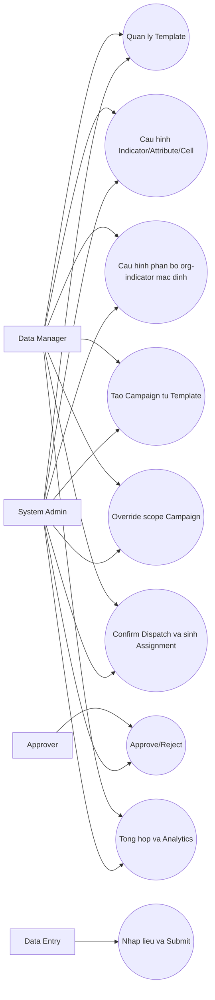
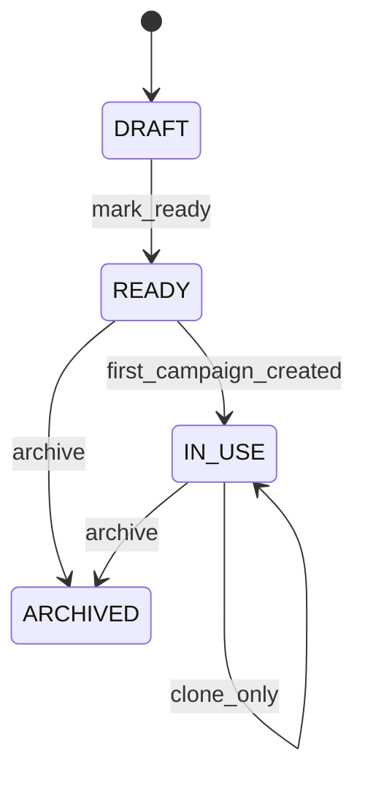
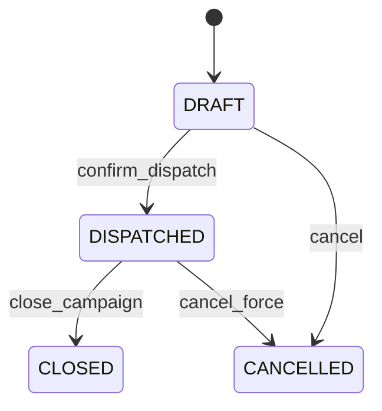
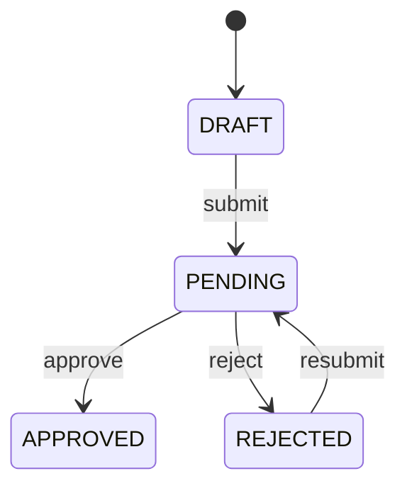
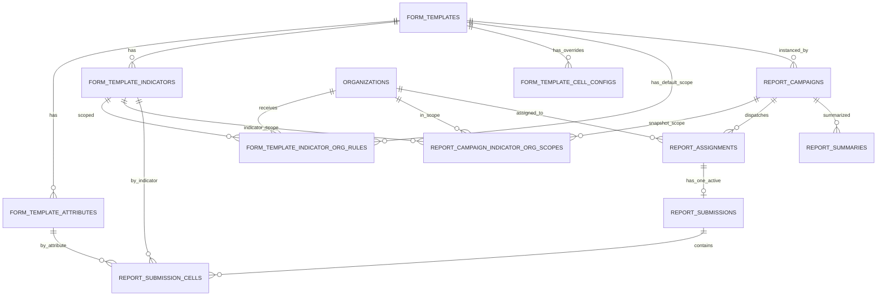

# KPI REPORT SYSTEM - TECHNICAL SPEC (v1)

## 1. Overview
Tai lieu nay mo ta thiet ke ky thuat chi tiet cho nghiep vu:
`Thiet ke bieu mau -> Giao viec theo ky -> Nhap lieu/Nop -> Duyet -> Tong hop/Phan tich`.

Muc tieu:
- Chuan hoa mo hinh `Template -> Campaign -> Assignment -> Submission -> Summary`.
- Khoa sua cau truc template sau khi phat sinh campaign/report.
- Ho tro co che ke thua va override scope chi tieu theo tung campaign.
- Sinh assignment chi sau buoc user confirm dispatch.

Thuat ngu:
- Template: khuon cau truc bao cao.
- Campaign: dot bao cao theo ky, su dung 1 template.
- Assignment: giao bao cao cho 1 don vi trong 1 campaign.
- Submission: ban nop cua don vi cho assignment.
- Summary: tong hop ket qua.

## 2. Scope nghiep vu
### 2.1 Template Management
- Quan ly template CRUD + clone.
- Cau hinh indicators, attributes, formula, cell config override.
- Cau hinh phan bo don vi + chi tieu o muc template default.
- Ho tro `template_type`: `AGGREGATE` / `UNIQUE`.

### 2.2 Report Campaign Management
- Tao campaign tu template.
- Tu dong snapshot scope tu template vao campaign.
- Cho phep override scope khi campaign con `DRAFT`.
- Confirm dispatch -> sinh assignment.

### 2.3 Submission / Approval
- Don vi tao ban nop, luu nhap lieu, submit.
- Approver duyet hoac tu choi.

### 2.4 Summary / Analytics
- Tong hop du lieu da duyet.
- Dashboard, KPI, query report.

## 3. Use Case Diagram

## 4. State Diagram
### 4.1 Template

Rule:
- `DRAFT`, `READY`: cho sua cau truc.
- `IN_USE`: cam sua cau truc; cho clone.
- Da co campaign/report: cam deactivate/delete/update cau truc.

### 4.2 Campaign

Rule:
- Chi `DRAFT` duoc sua scope org/indicator.
- `confirm_dispatch` la diem sinh assignment.

### 4.3 Submission

## 5. ERD (logical)

## 6. Data model details
### 6.1 form_templates
- Add `template_type`: `AGGREGATE|UNIQUE`
- Add `template_status`: `DRAFT|READY|IN_USE|ARCHIVED`

### 6.2 form_template_indicator_org_rules (new)
- default scope org-indicator cua template.
- unique `(template_id, org_id, indicator_id)`.

### 6.3 report_campaigns (new)
- unique `(template_id, period_type, period_code)`.
- status lifecycle `DRAFT -> DISPATCHED -> CLOSED|CANCELLED`.

### 6.4 report_campaign_indicator_org_scopes (new)
- snapshot scope cua campaign.
- unique `(campaign_id, org_id, indicator_id)`.
- neu template_type=`UNIQUE`, enforce business unique `(campaign_id, indicator_id)`.

### 6.5 report_assignments
- sinh duy nhat sau `confirm_dispatch`.
- unique `(campaign_id, org_id)`.

### 6.6 report_submissions / report_submission_cells
- giu nguyen logic versioning optimistic lock.
- validate theo scope assignment/campaign.

## 7. Business flow details
1. Tao template DRAFT.
2. Cau hinh indicators/attributes/cell-config/rules.
3. Mark READY.
4. Tao campaign DRAFT tu template.
5. Snapshot scope tu template vao campaign scope.
6. User override campaign scope (neu can).
7. Confirm dispatch.
8. He thong sinh report_assignments.
9. Don vi tao submission, patch cells, submit.
10. Approver approve/reject.
11. Summary/analytics tong hop du lieu.

## 8. Key constraints
1. Template co campaign/report thi khoa sua cau truc.
2. Campaign chi cho sua scope khi DRAFT.
3. Assignment khong sinh truoc confirm_dispatch.
4. Submission chi sua duoc khi DRAFT/REJECTED.
5. Rule UNIQUE enforce khong trung indicator trong cung campaign.
6. Formula cell => readOnly=true.

## 9. Non-functional notes
- Tat ca action state-transition quan trong can audit log.
- Dung transaction cho cac operation batch (snapshot, confirm dispatch, bulk assignment).
- De xuat idempotency key cho endpoint confirm_dispatch.
- De xuat lock optimistic cho campaign edit de tranh conflict nguoi dung.

## 10. Acceptance criteria
1. Co the tao campaign tu template va nhin thay snapshot scope.
2. Override scope campaign trong DRAFT hoat dong dung.
3. Confirm dispatch sinh assignment dung so don vi.
4. Sau dispatch khong sua duoc scope.
5. Submission/approval theo dung state machine.
6. Tong hop du lieu duoc sinh tu submissions hop le.
