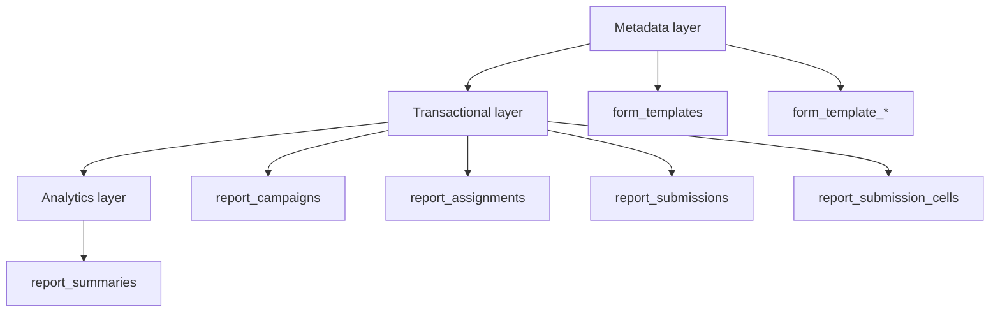

# System Architecture

## Muc tieu he thong
He thong quan ly KPI cap xa dung flow:
`Template -> Campaign -> Assignment -> Submission -> Approval -> Summary`

## Bounded contexts

| Context | Module | Trach nhiem chinh | Tables chinh |
| --- | --- | --- | --- |
| Identity & Access | `auth`, `user`, `role` | dang nhap, refresh token, password reset, RBAC | `users`, `roles`, `permissions`, `user_roles`, `role_permissions`, `auth_refresh_tokens`, `auth_password_resets` |
| Organization | `organization` | cay don vi, scope tree | `organizations`, `organization_closure` |
| Template Metadata | `template-management` | thiet ke form, indicator, attribute, cell config, scope mac dinh | `form_templates`, `form_template_attributes`, `form_template_indicators`, `form_template_cell_configs`, `form_template_indicator_org_rules`, `field_categories`, `indicator_catalog` |
| Allocation & Campaign | `report-campaign` + `assignment` | tao dot bao cao, snapshot scope, phat hanh giao viec | `report_campaigns`, `report_campaign_indicator_org_scopes`, `report_assignments`, `report_campaign_default_values` |
| Submission & Approval | `submission`, `approval` | tao submission, patch cell, submit, duyet/tra lai | `report_submissions`, `report_submission_cells`, `submission_flow_logs` |
| Analytics | `summary-analytics` | tong hop, dashboard, pivot, summary read model | `report_summaries` |
| Governance | `audit-log`, `notification` | audit trail, outbox / notification event | `audit_logs`, `app_outbox_events` |

## Layering

## Data ownership

### Template management owns metadata
- Chu ky song dai.
- Thay doi phai co guard de khong pha lich su campaign da tao.
- Khong luu du lieu runtime cua don vi vao layer nay.

### Campaign and assignment own transactional orchestration
- Campaign snapshot scope va default values.
- Assignment sinh sau confirm dispatch.
- Assignment la don vi giao viec cho tung org trong tung campaign.

### Submission and approval own write-time fact data
- Submission luu trang thai va du lieu nhap lieu.
- Approval khong ghi truc tiep vao template hay campaign.
- History cua trang thai duoc luu rieng de audit va truy vet.

### Analytics owns derived read model
- Summary duoc tinh tu submission da duyet + default values.
- Khong dung dashboard query truc tiep vao raw submission cells o scale lon.

## Module interaction rules
- `template-management` khong tu y tao assignment.
- `report-campaign` khong tu y thay doi template structure.
- `submission` khong duoc bypass scope va lock rules.
- `summary-analytics` chi doc du lieu da hop le.
- `audit-log` va `notification` la side effect, khong nam trong critical path cua business state.

## Naming model
- Table names: snake_case, so nhieu.
- PK: `id` uuid.
- FK: `<entity>_id`.
- Timestamps: `created_at`, `updated_at`, va `deleted_at` chi dung cho master data.

