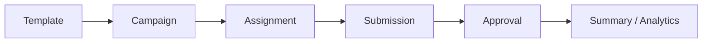
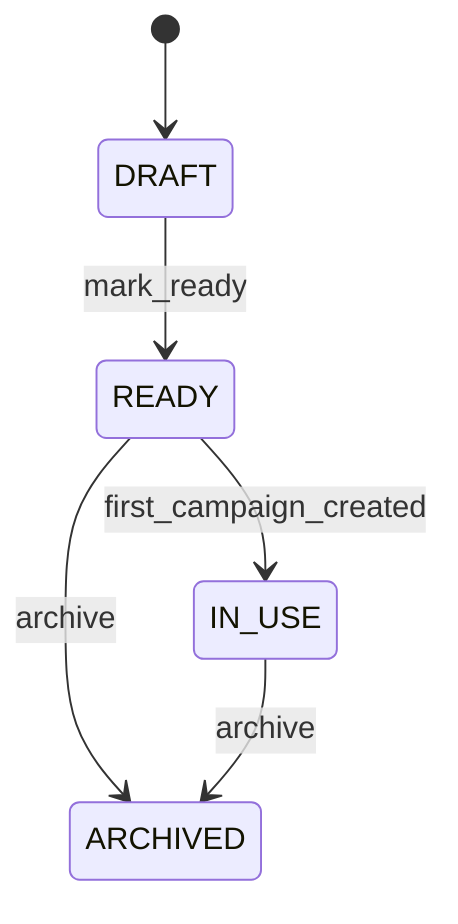
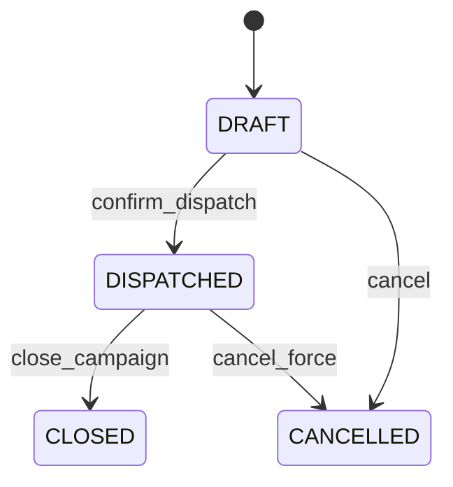
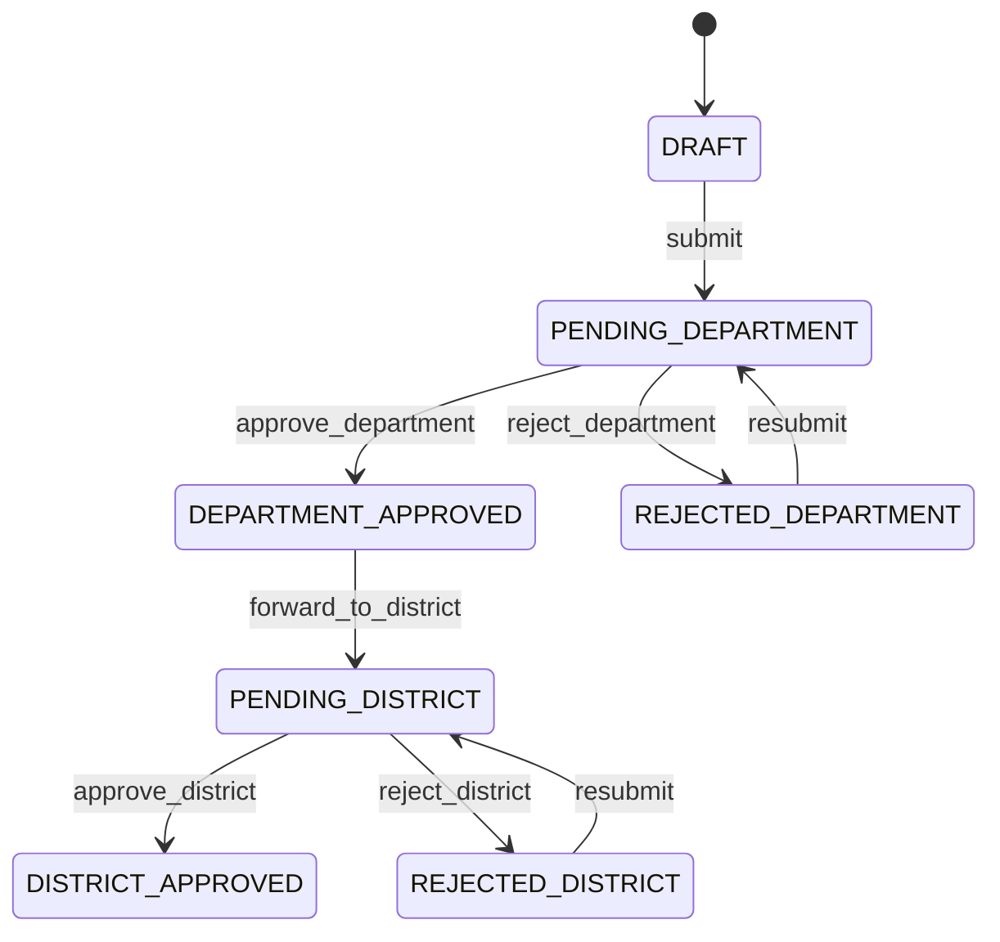

# End-to-End Flow

## 1. Core flow

## 2. Template lifecycle

Rules:
- `DRAFT` va `READY` duoc sua cau truc.
- `IN_USE` khoa cau truc, chi cho clone.
- Template da co campaign thi phai coi la da vao vung immutable ve structure.

## 3. Campaign lifecycle

Rules:
- Chi `DRAFT` duoc sua scope, default values, deadline.
- `confirm_dispatch` la diem snapshot scope va sinh assignment.
- Sau `DISPATCHED`, scope va default values bi khoa.

## 4. Submission lifecycle

Code hien tai dung mo hinh 2 cap duyet:

Rules:
- Cell chi duoc patch khi submission con mo va khong bi lock.
- Submit se dong trang thai nhap lieu va chuyen sang pending level dau tien.
- Approve/reject phai ghi history rieng va audit event.

## 5. Data movement theo buoc

### Buoc 1: Tao template
- Tao `form_templates`.
- Cau hinh `form_template_indicators`, `form_template_attributes`.
- Tao `form_template_cell_configs`.
- Tao `form_template_indicator_org_rules` neu co scope mac dinh.

### Buoc 2: Tao campaign
- Clone metadata can thiet tu template.
- Tao `report_campaigns` o `DRAFT`.
- Snapshot scope sang `report_campaign_indicator_org_scopes`.
- Set `report_campaign_default_values` neu can gia tri dien san.

### Buoc 3: Confirm dispatch
- Khoa scope va default values.
- Sinh `report_assignments` cho tung org duoc giao.
- Ghi audit log / side effect neu co.

### Buoc 4: Input va submit
- Don vi mo assignment va tao `report_submissions`.
- Luu `report_submission_cells` theo tung o hop le.
- Patch chi dung cho o khong bi lock.

### Buoc 5: Approval
- Duyet / tra lai theo 2 cap.
- Ghi `submission_flow_logs`.
- Cap nhat timestamp va actor approval tren submission.

### Buoc 6: Summary
- Tong hop chi tu submission hop le.
- Merge theo thu tu uu tien:
  1. default values cua campaign
  2. submission cells da duyet
- Update `report_summaries` va cac read model lien quan.

## 6. Entry points quan trong
- `mark_ready` / `archive` cho template.
- `create campaign` / `upsert campaign scope` / `upsert default values`.
- `confirm_dispatch`.
- `open submission` / `patch cells` / `submit`.
- `approve` / `reject`.
- `recompute summary`.
