# ERD - KPI System (Canonical)

ERD duoi day tong hop tu bo tai lieu trong `docs/db` (overview + modules), theo mo hinh du lieu canonical.

```mermaid
erDiagram
    %% Identity & Access
    users {
      uuid id PK
      uuid org_id FK
      string username UK
      string email UK
      string status
      datetime created_at
      datetime updated_at
    }

    roles {
      uuid id PK
      string code UK
      string name
      datetime created_at
      datetime updated_at
    }

    permissions {
      uuid id PK
      string code UK
      string name
      datetime created_at
      datetime updated_at
    }

    user_roles {
      uuid user_id FK
      uuid role_id FK
      datetime created_at
    }

    role_permissions {
      uuid role_id FK
      uuid permission_id FK
      datetime created_at
    }

    auth_refresh_tokens {
      uuid id PK
      uuid user_id FK
      string token_hash UK
      datetime expires_at
      datetime revoked_at
      datetime created_at
    }

    auth_password_resets {
      uuid id PK
      uuid user_id FK
      string token_hash UK
      datetime expires_at
      datetime used_at
      datetime created_at
    }

    %% Organizations
    organizations {
      uuid id PK
      uuid parent_id FK
      string code UK
      string name
      int level
      boolean can_assign_reports
      boolean is_active
      datetime created_at
      datetime updated_at
      datetime deleted_at
    }

    organization_closure {
      uuid ancestor_id FK
      uuid descendant_id FK
      int depth
    }

    %% Templates Metadata
    field_categories {
      uuid id PK
      string code UK
      string name
    }

    indicator_catalog {
      uuid id PK
      string code UK
      string name
      uuid field_category_id FK
    }

    form_templates {
      uuid id PK
      string code UK
      string template_status
      string template_type
      string period_type
      datetime created_at
      datetime updated_at
    }

    form_template_attributes {
      uuid id PK
      uuid template_id FK
      uuid parent_id FK
      string code
      string name
      int sort_order
    }

    form_template_indicators {
      uuid id PK
      uuid template_id FK
      uuid parent_id FK
      uuid indicator_catalog_id FK
      string code
      string name
      int sort_order
    }

    form_template_cell_configs {
      uuid id PK
      uuid template_id FK
      uuid indicator_id FK
      uuid attribute_id FK
      string input_type
      boolean is_required
      boolean is_formula
    }

    form_template_indicator_org_rules {
      uuid id PK
      uuid template_id FK
      uuid indicator_id FK
      uuid org_id FK
      boolean is_enabled
    }

    %% Campaign & Allocation
    report_campaigns {
      uuid id PK
      uuid template_id FK
      string period_type
      string period_code
      string status
      datetime deadline_from
      datetime deadline_to
      datetime created_at
      datetime updated_at
    }

    report_campaign_indicator_org_scopes {
      uuid id PK
      uuid campaign_id FK
      uuid org_id FK
      uuid indicator_id FK
      boolean is_assigned
    }

    report_assignments {
      uuid id PK
      uuid campaign_id FK
      uuid org_id FK
      string status
      datetime deadline_to
      datetime dispatched_at
      datetime created_at
      datetime updated_at
    }

    %% Submissions
    report_submissions {
      uuid id PK
      uuid assignment_id FK
      string code UK
      string status
      int version
      datetime submitted_at
      datetime approved_at
      datetime rejected_at
      datetime created_at
      datetime updated_at
    }

    report_submission_cells {
      uuid id PK
      uuid submission_id FK
      uuid indicator_id FK
      uuid attribute_id FK
      text value_text
      numeric value_number
      string value_type
      datetime created_at
      datetime updated_at
    }

    %% Analytics
    report_summaries {
      uuid id PK
      uuid campaign_id FK
      uuid template_id FK
      uuid org_id FK
      string status
      jsonb summary_data
      datetime created_at
      datetime updated_at
    }

    %% Governance
    audit_logs {
      uuid id PK
      uuid user_id FK
      string table_name
      uuid record_id
      string action
      jsonb before_data
      jsonb after_data
      string correlation_id
      datetime created_at
    }

    idempotency_keys {
      uuid id PK
      string scope
      string idempotency_key
      datetime expires_at
      datetime created_at
    }

    app_outbox_events {
      uuid id PK
      string aggregate_type
      uuid aggregate_id
      string status
      datetime next_retry_at
      datetime created_at
    }

    schema_migration_locks {
      uuid id PK
      string lock_key UK
      datetime created_at
    }

    %% Relationships
    organizations ||--o{ users : has
    organizations ||--o{ organizations : parent_of
    organizations ||--o{ organization_closure : ancestor
    organizations ||--o{ organization_closure : descendant

    users ||--o{ user_roles : maps
    roles ||--o{ user_roles : maps
    roles ||--o{ role_permissions : grants
    permissions ||--o{ role_permissions : grants
    users ||--o{ auth_refresh_tokens : owns
    users ||--o{ auth_password_resets : requests

    field_categories ||--o{ indicator_catalog : groups
    form_templates ||--o{ form_template_attributes : has
    form_templates ||--o{ form_template_indicators : has
    form_templates ||--o{ form_template_cell_configs : has
    form_templates ||--o{ form_template_indicator_org_rules : has
    form_template_attributes ||--o{ form_template_attributes : parent_of
    form_template_indicators ||--o{ form_template_indicators : parent_of
    indicator_catalog ||--o{ form_template_indicators : referenced_by
    form_template_indicators ||--o{ form_template_cell_configs : config_for
    form_template_attributes ||--o{ form_template_cell_configs : config_for
    organizations ||--o{ form_template_indicator_org_rules : scoped_for
    form_template_indicators ||--o{ form_template_indicator_org_rules : applies_to

    form_templates ||--o{ report_campaigns : instantiates
    report_campaigns ||--o{ report_campaign_indicator_org_scopes : allocates
    organizations ||--o{ report_campaign_indicator_org_scopes : receives
    form_template_indicators ||--o{ report_campaign_indicator_org_scopes : scoped_indicator

    report_campaigns ||--o{ report_assignments : dispatches
    organizations ||--o{ report_assignments : assigned_to

    report_assignments ||--o{ report_submissions : has
    report_submissions ||--o{ report_submission_cells : contains
    form_template_indicators ||--o{ report_submission_cells : for_indicator
    form_template_attributes ||--o{ report_submission_cells : for_attribute

    report_campaigns ||--o{ report_summaries : summarized_in
    organizations ||--o{ report_summaries : summarized_for
    form_templates ||--o{ report_summaries : based_on

    users ||--o{ audit_logs : acts
```

## Notes
- Day la ERD logic/canonical tu tai lieu phan tich, khong phai DDL vat ly day du.
- Cac read model/materialized view (`report_progress_view`, `mv_kpi_*`) khong ve nhu bang giao dich chinh trong ERD nay.
