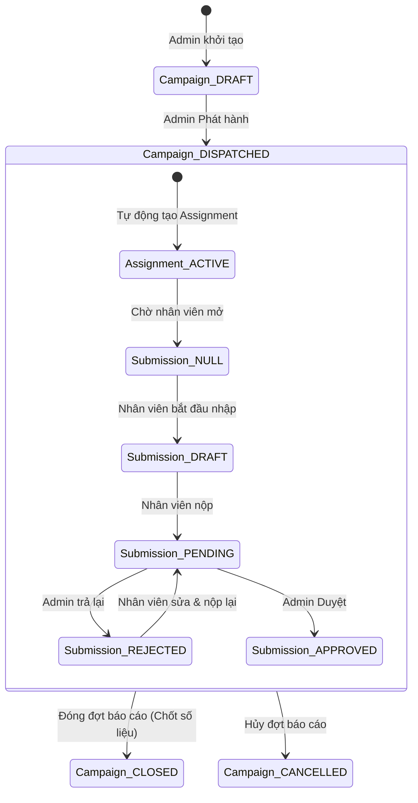

# Tài liệu Luồng Dữ liệu & Trạng thái: Campaign - Assignment - Submission

Tài liệu này mô tả vòng đời của một đợt báo cáo từ khi khởi tạo đến khi chốt số liệu, tập trung vào sự thay đổi trạng thái của 3 bảng dữ liệu chính.

---

## 1. Cấu trúc 3 Lớp Dữ liệu

| Bảng dữ liệu | Thực thể | Cấp độ | Vai trò |
| :--- | :--- | :--- | :--- |
| `report_campaigns` | **Campaign** | Toàn hệ thống | Quản lý đợt báo cáo tổng (Kỳ báo cáo, Thời hạn). |
| `report_assignments` | **Assignment** | Đơn vị | Quản lý việc giao chỉ tiêu cho từng phòng ban/đơn vị. |
| `report_submissions` | **Submission** | Dữ liệu chi tiết | Quản lý nội dung số liệu nhập vào và quy trình phê duyệt. |

---

## 2. Ma trận Trạng thái & Luồng Nghiệp vụ

### Giai đoạn 1: Chuẩn bị (Admin)
- **Hành động:** Admin tạo Đợt báo cáo, chọn biểu mẫu và thiết lập thời hạn.
- **Trạng thái:**
    - `report_campaigns`: **DRAFT**
    - `report_assignments`: Chưa tồn tại.
    - `report_submissions`: Chưa tồn tại.

### Giai đoạn 2: Phát hành (Dispatch)
- **Hành động:** Admin nhấn "Phát hành" (Confirm Dispatch).
- **Trạng thái:**
    - `report_campaigns`: **DISPATCHED**
    - `report_assignments`: Được tạo hàng loạt cho các đơn vị. Trạng thái mặc định: **ACTIVE**.
    - `report_submissions`: Chưa tồn tại (Null).
    - **Hiển thị giao diện:** Admin thấy đơn vị ở trạng thái `Chưa bắt đầu` (Not Started).

### Giai đoạn 3: Nhập liệu (Staff)
- **Hành động:** Nhân viên đơn vị nhấn vào báo cáo để nhập.
- **Trạng thái:**
    - `report_assignments`: **ACTIVE**
    - `report_submissions`: Tự động tạo mới với trạng thái **DRAFT**.
    - **Hiển thị giao diện:** Cả Admin và Staff thấy đơn vị ở trạng thái `Đang nhập` (Drafting).

### Giai đoạn 4: Nộp báo cáo (Staff)
- **Hành động:** Nhân viên nhấn "Nộp báo cáo" (Submit).
- **Trạng thái:**
    - `report_submissions`: Chuyển sang **PENDING**. Dữ liệu bị khóa.
    - **Hiển thị giao diện:** Admin thấy trạng thái `Chờ duyệt` (Pending Approval).

### Giai đoạn 5: Phê duyệt (Admin/Manager)
- **Hành động:** Admin kiểm tra số liệu và ra quyết định.
- **Kịch bản A (Từ chối):**
    - `report_submissions`: Chuyển về **REJECTED**.
    - **Kết quả:** Staff thấy thông báo bị trả lại, báo cáo mở khóa để sửa.
- **Kịch bản B (Duyệt):**
    - `report_submissions`: Chuyển sang **APPROVED**.
    - **Kết quả:** Dữ liệu được đưa vào kho tổng hợp (Analytics).

---

## 3. Sơ đồ logic trạng thái (State Machine)

---

## 4. Lưu ý quan trọng về tính đồng bộ

1.  **Trạng thái ảo:** Trạng thái hiển thị trên giao diện Admin (`Not Started`, `Drafting`, `Overdue`) là kết quả của việc tính toán động từ `deadlineTo` và `Submission.status`.
2.  **Ràng buộc dữ liệu:** Một Assignment chỉ có thể liên kết với **duy nhất một** Submission đang hoạt động.
3.  **Khóa dữ liệu:** Khi `report_submissions.status` là `PENDING` hoặc `APPROVED`, mọi API `PATCH` cập nhật ô dữ liệu (`report_submission_cells`) phải bị chặn từ phía Backend.
